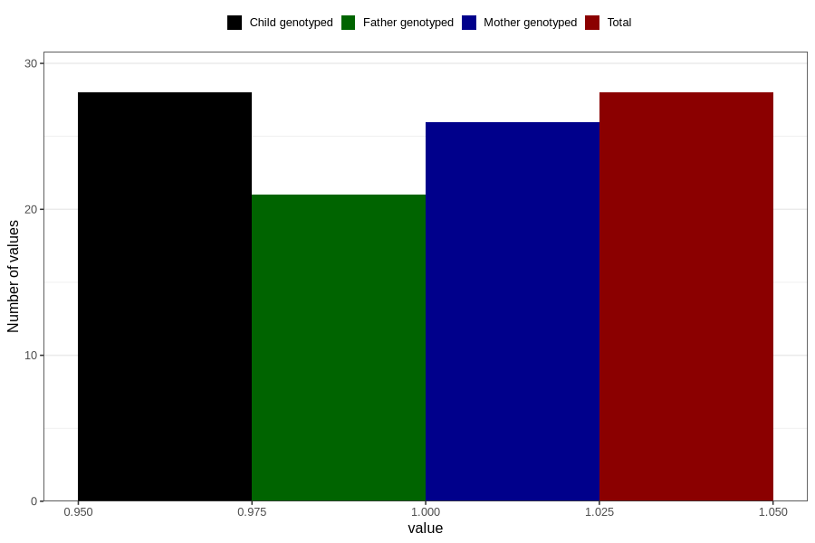

# hospitalized_high_blood_pressure_25_28w
Variable mapping to `CC180` in `Skjema3_v12`.
- Number of values:

| Value | Total | Child genotyped | Mother genotyped | Father genotyped |
| ----- | ----- | --------------- | ---------------- | ---------------- |
| Missing | 80778 | 80778 | 75998 | 53142 |
| Non-missing | 28 | 28 | 26 | 21 |
| 1 | 28 | 28 | 26 | 21 |

