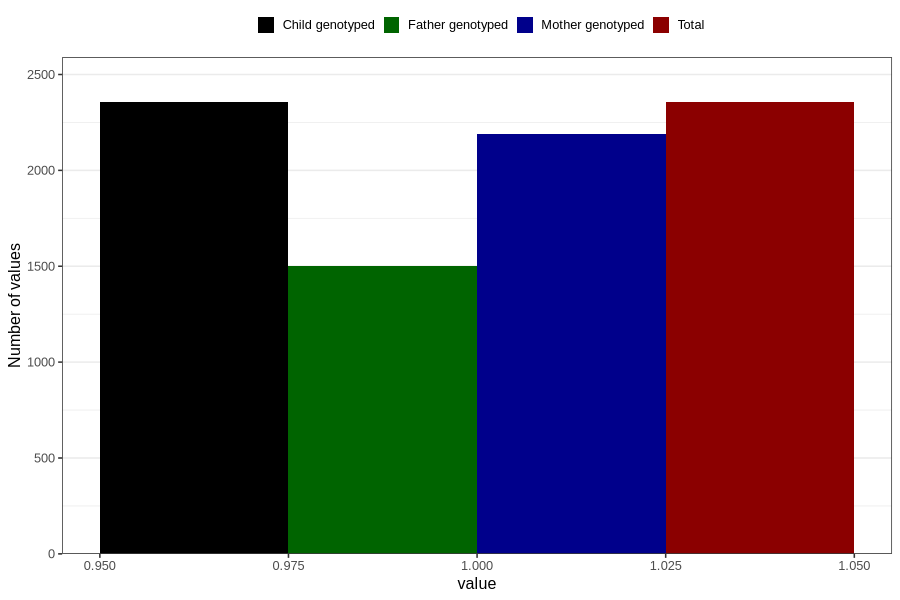

# hospitalized_other
Variable mapping to `CC191` in `Skjema3_v12`.
- Number of values:

| Value | Total | Child genotyped | Mother genotyped | Father genotyped |
| ----- | ----- | --------------- | ---------------- | ---------------- |
| Missing | 78451 | 78451 | 73833 | 51662 |
| Non-missing | 2355 | 2355 | 2191 | 1501 |
| 1 | 2355 | 2355 | 2191 | 1501 |

