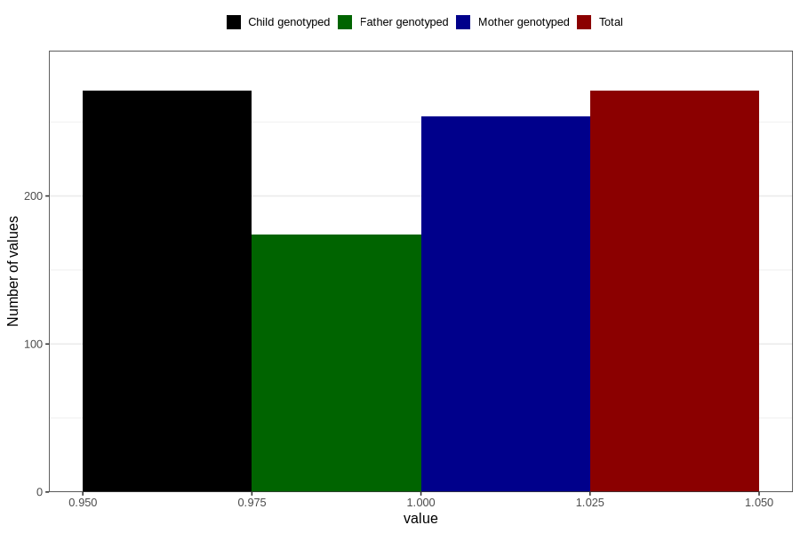

# hospitalized_other_17_20w
Variable mapping to `CC196` in `Skjema3_v12`.
- Number of values:

| Value | Total | Child genotyped | Mother genotyped | Father genotyped |
| ----- | ----- | --------------- | ---------------- | ---------------- |
| Missing | 80535 | 80535 | 75770 | 52989 |
| Non-missing | 271 | 271 | 254 | 174 |
| 1 | 271 | 271 | 254 | 174 |

