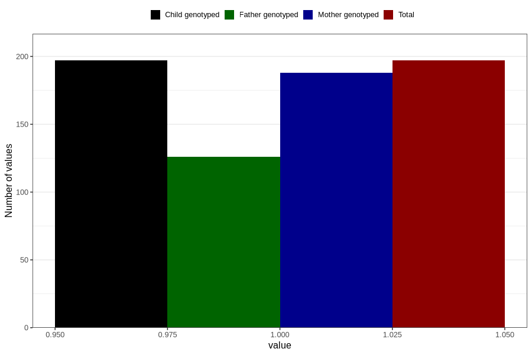

# hospitalized_other_5_8w
Variable mapping to `CC193` in `Skjema3_v12`.
- Number of values:

| Value | Total | Child genotyped | Mother genotyped | Father genotyped |
| ----- | ----- | --------------- | ---------------- | ---------------- |
| Missing | 80609 | 80609 | 75836 | 53037 |
| Non-missing | 197 | 197 | 188 | 126 |
| 1 | 197 | 197 | 188 | 126 |

