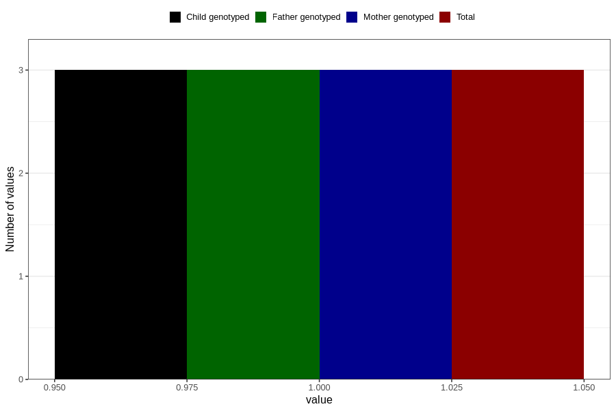

# hospitalized_pre_eclampsia_17_20w
Variable mapping to `CC187` in `Skjema3_v12`.
- Number of values:

| Value | Total | Child genotyped | Mother genotyped | Father genotyped |
| ----- | ----- | --------------- | ---------------- | ---------------- |
| Missing | 80803 | 80803 | 76021 | 53160 |
| Non-missing | 3 | 3 | 3 | 3 |
| 1 | 3 | 3 | 3 | 3 |

