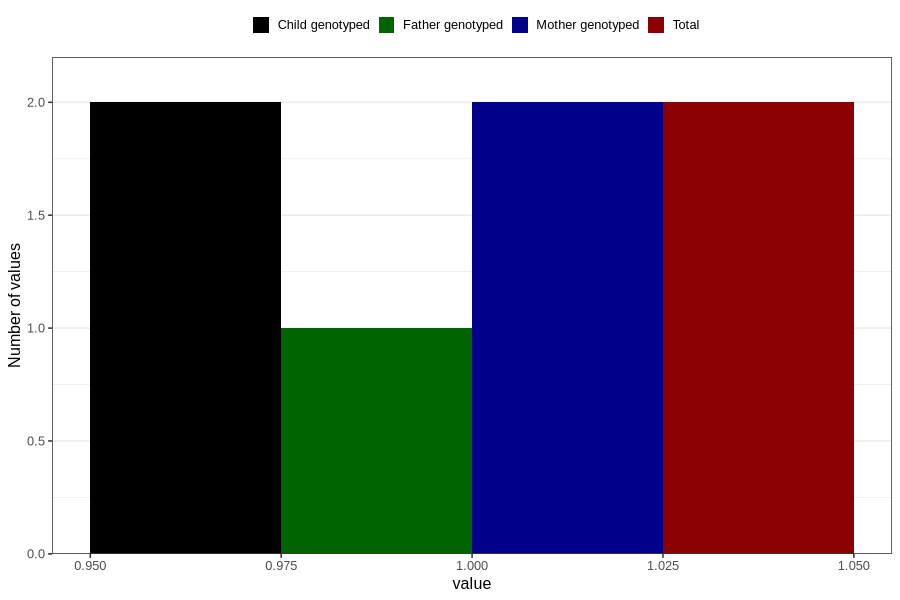

# hospitalized_pre_eclampsia_5_8w
Variable mapping to `CC184` in `Skjema3_v12`.
- Number of values:

| Value | Total | Child genotyped | Mother genotyped | Father genotyped |
| ----- | ----- | --------------- | ---------------- | ---------------- |
| Missing | 80804 | 80804 | 76022 | 53162 |
| Non-missing | 2 | 2 | 2 | 1 |
| 1 | 2 | 2 | 2 | 1 |

