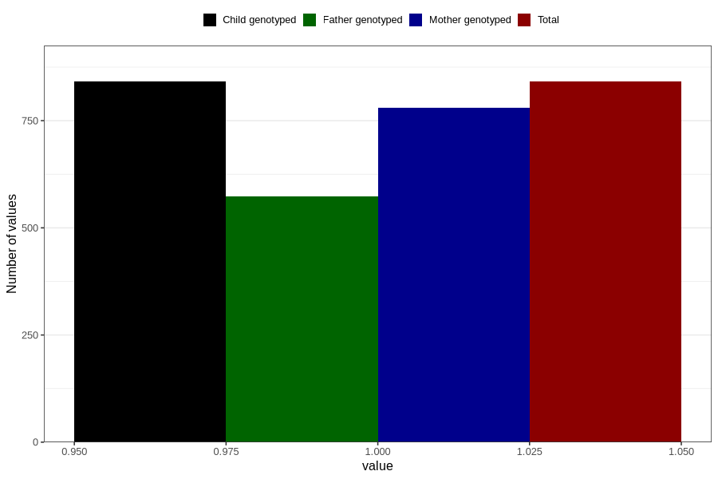

# hospitalized_prolonged_nausea_vomiting
Variable mapping to `CC137` in `Skjema3_v12`.
- Number of values:

| Value | Total | Child genotyped | Mother genotyped | Father genotyped |
| ----- | ----- | --------------- | ---------------- | ---------------- |
| Missing | 79965 | 79965 | 75243 | 52589 |
| Non-missing | 841 | 841 | 781 | 574 |
| 1 | 841 | 841 | 781 | 574 |

