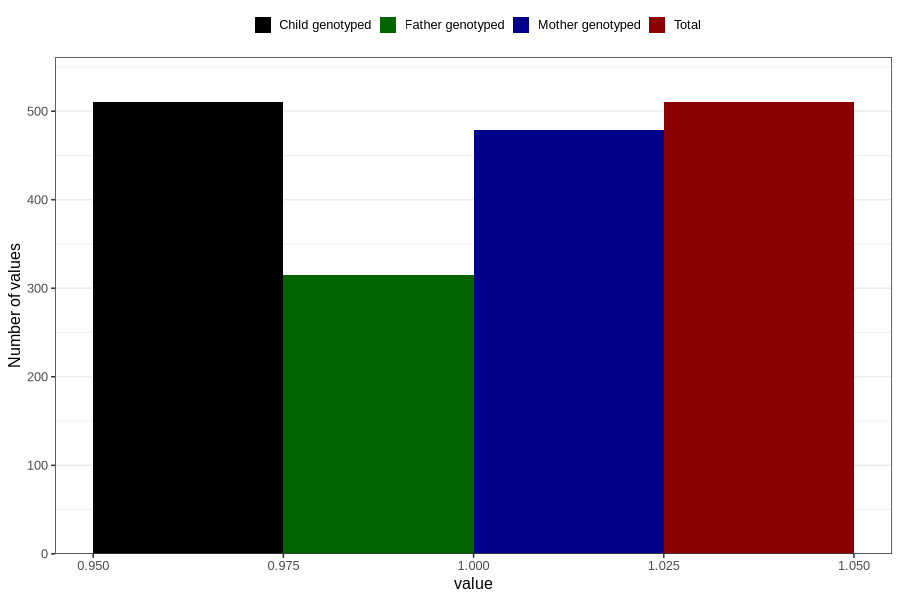

# hospitalized_threatening_preterm_labour
Variable mapping to `CC164` in `Skjema3_v12`.
- Number of values:

| Value | Total | Child genotyped | Mother genotyped | Father genotyped |
| ----- | ----- | --------------- | ---------------- | ---------------- |
| Missing | 80296 | 80296 | 75545 | 52848 |
| Non-missing | 510 | 510 | 479 | 315 |
| 1 | 510 | 510 | 479 | 315 |

