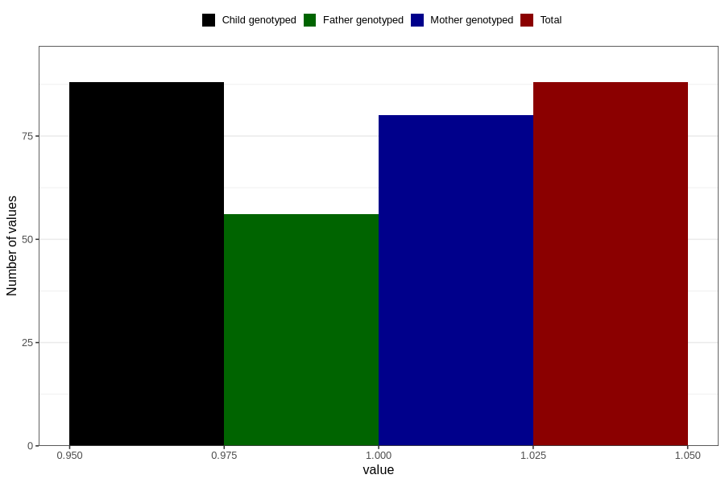

# hospitalized_threatening_preterm_labour_21_24w
Variable mapping to `CC170` in `Skjema3_v12`.
- Number of values:

| Value | Total | Child genotyped | Mother genotyped | Father genotyped |
| ----- | ----- | --------------- | ---------------- | ---------------- |
| Missing | 80718 | 80718 | 75944 | 53107 |
| Non-missing | 88 | 88 | 80 | 56 |
| 1 | 88 | 88 | 80 | 56 |

