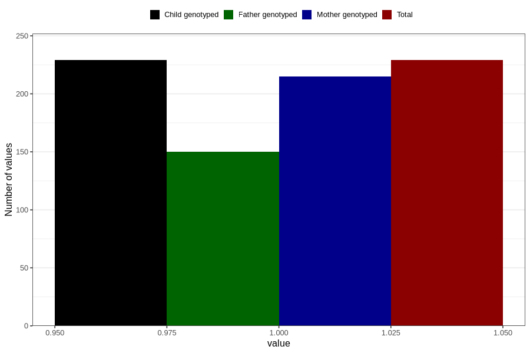

# hospitalized_threatening_preterm_labour_after_29w
Variable mapping to `CC172` in `Skjema3_v12`.
- Number of values:

| Value | Total | Child genotyped | Mother genotyped | Father genotyped |
| ----- | ----- | --------------- | ---------------- | ---------------- |
| Missing | 80577 | 80577 | 75809 | 53013 |
| Non-missing | 229 | 229 | 215 | 150 |
| 1 | 229 | 229 | 215 | 150 |

