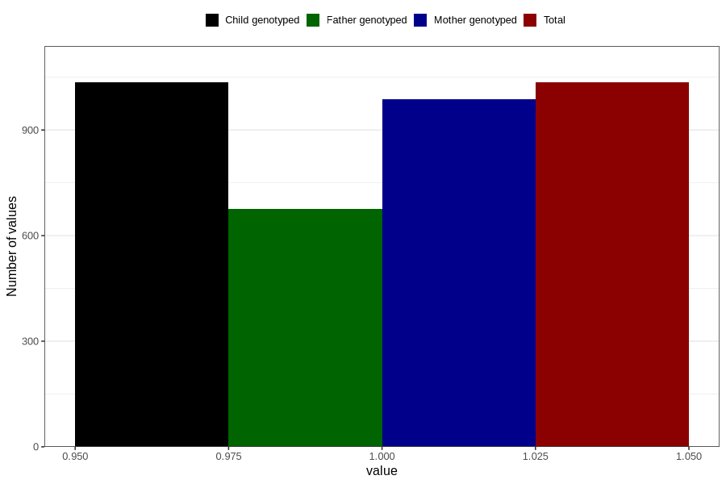

# influenza_5w_8w
Variable mapping to `AA377` in `Skjema1_v12`.
- Number of values:

| Value | Total | Child genotyped | Mother genotyped | Father genotyped |
| ----- | ----- | --------------- | ---------------- | ---------------- |
| Missing | 79771 | 79771 | 75037 | 52488 |
| Non-missing | 1035 | 1035 | 987 | 675 |
| 1 | 1035 | 1035 | 987 | 675 |

