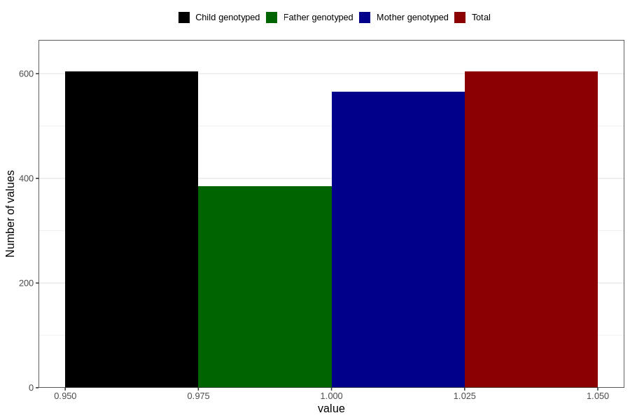

# influenza_before_4w
Variable mapping to `AA376` in `Skjema1_v12`.
- Number of values:

| Value | Total | Child genotyped | Mother genotyped | Father genotyped |
| ----- | ----- | --------------- | ---------------- | ---------------- |
| Missing | 80202 | 80202 | 75458 | 52778 |
| Non-missing | 604 | 604 | 566 | 385 |
| 1 | 604 | 604 | 566 | 385 |

