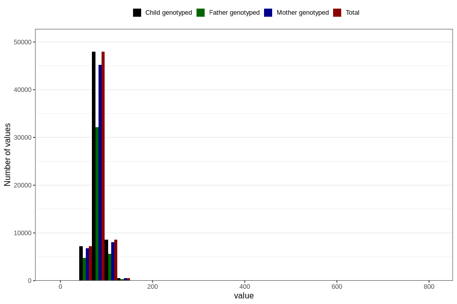

# mother_weight_end_self
Variable mapping to `DD672` in `Skjema4_6mnd_v12`.
- Number of values:

| Value | Total | Child genotyped | Mother genotyped | Father genotyped |
| ----- | ----- | --------------- | ---------------- | ---------------- |
| Missing | 16537 | 16537 | 15449 | 10251 |
| Non-missing | 64269 | 64269 | 60575 | 42912 |
| 25th percentile | 74 | 74 | 74 | 73.8 |
| 50th percentile | 81 | 81 | 81 | 81 |
| 75th percentile | 90 | 90 | 90 | 90 |
| Mean | 82.8576841089794 | 82.8576841089794 | 82.8187519603797 | 82.7855774608501 |
| Standard deviation | 14.0465203813802 | 14.0465203813802 | 14.0547653833373 | 13.9359079711435 |
| N | 64269 | 64269 | 60575 | 42912 |

