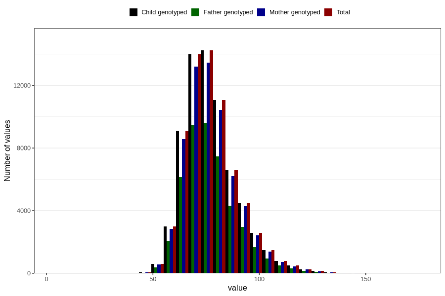

# mother_weight_last_check_30w
Variable mapping to `CC131` in `Skjema3_v12`.
- Number of values:

| Value | Total | Child genotyped | Mother genotyped | Father genotyped |
| ----- | ----- | --------------- | ---------------- | ---------------- |
| Missing | 11827 | 11827 | 11017 | 6947 |
| Non-missing | 68979 | 68979 | 65007 | 46216 |
| 25th percentile | 68.7 | 68.7 | 68.7 | 68.6 |
| 50th percentile | 75.5 | 75.5 | 75.5 | 75.3 |
| 75th percentile | 84 | 84 | 84 | 84 |
| Mean | 77.3741341567724 | 77.3741341567724 | 77.347968680296 | 77.2189003808205 |
| Standard deviation | 12.543953105775 | 12.543953105775 | 12.5111043495042 | 12.4539882806386 |
| N | 68979 | 68979 | 65007 | 46216 |

