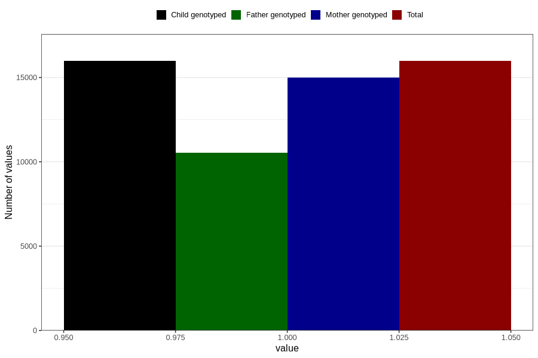

# nausea_before_4w
Variable mapping to `AA216` in `Skjema1_v12`.
- Number of values:

| Value | Total | Child genotyped | Mother genotyped | Father genotyped |
| ----- | ----- | --------------- | ---------------- | ---------------- |
| Missing | 64832 | 64832 | 61026 | 42635 |
| Non-missing | 15974 | 15974 | 14998 | 10528 |
| 1 | 15974 | 15974 | 14998 | 10528 |

