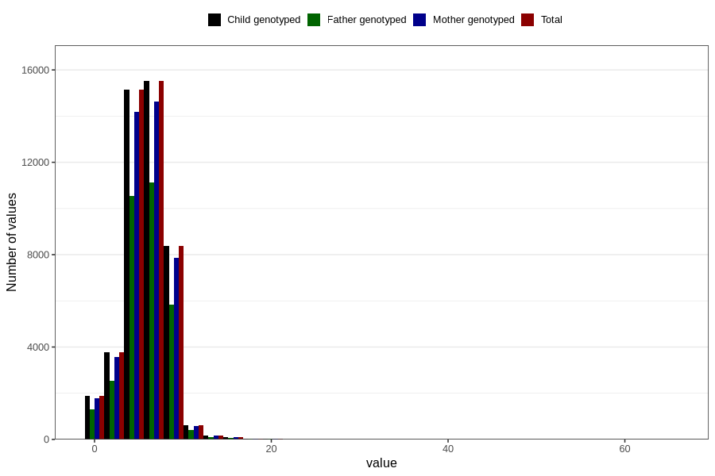

# nausea_week_most_bothered_from_q2
Variable mapping to `BB853` in `Skjema2CDW_v12`.
- Number of values:

| Value | Total | Child genotyped | Mother genotyped | Father genotyped |
| ----- | ----- | --------------- | ---------------- | ---------------- |
| Missing | 35118 | 35118 | 33137 | 21200 |
| Non-missing | 45688 | 45688 | 42887 | 31963 |
| 25th percentile | 4 | 4 | 4 | 4 |
| 50th percentile | 6 | 6 | 6 | 6 |
| 75th percentile | 7 | 7 | 7 | 7 |
| Mean | 5.73030117317457 | 5.73030117317457 | 5.72812274115699 | 5.74482995964083 |
| Standard deviation | 2.38928582200715 | 2.38928582200715 | 2.38734866364173 | 2.36228761251588 |
| N | 45688 | 45688 | 42887 | 31963 |

