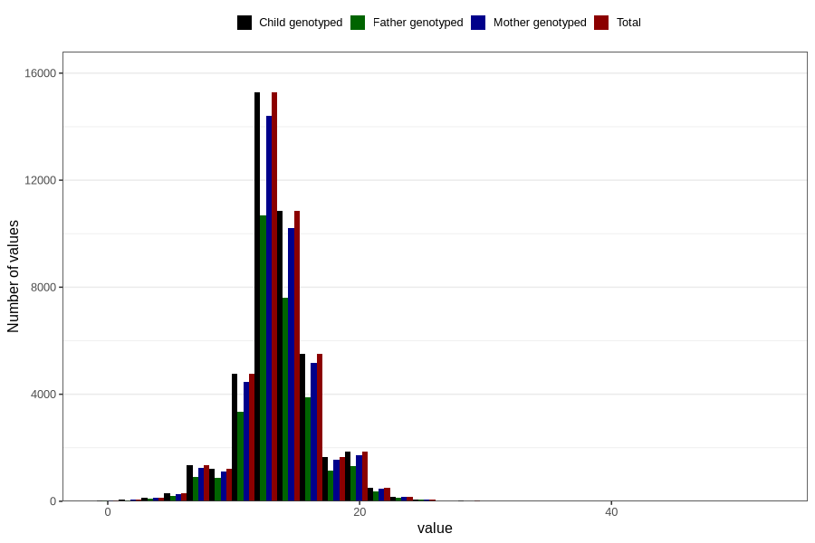

# nausea_week_most_bothered_to_q2
Variable mapping to `BB854` in `Skjema2CDW_v12`.
- Number of values:

| Value | Total | Child genotyped | Mother genotyped | Father genotyped |
| ----- | ----- | --------------- | ---------------- | ---------------- |
| Missing | 37009 | 37009 | 34899 | 22506 |
| Non-missing | 43797 | 43797 | 41125 | 30657 |
| 25th percentile | 12 | 12 | 12 | 12 |
| 50th percentile | 13 | 13 | 13 | 13 |
| 75th percentile | 15 | 15 | 15 | 15 |
| Mean | 13.5304701235244 | 13.5304701235244 | 13.5267598784195 | 13.5543595263724 |
| Standard deviation | 3.10775734466363 | 3.10775734466363 | 3.10130247696637 | 3.08593886098673 |
| N | 43797 | 43797 | 41125 | 30657 |

