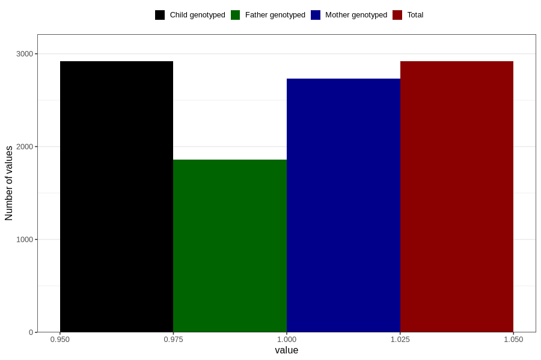

# oedema_13w_15w
Variable mapping to `AA319` in `Skjema1_v12`.
- Number of values:

| Value | Total | Child genotyped | Mother genotyped | Father genotyped |
| ----- | ----- | --------------- | ---------------- | ---------------- |
| Missing | 77888 | 77888 | 73290 | 51300 |
| Non-missing | 2918 | 2918 | 2734 | 1863 |
| 1 | 2918 | 2918 | 2734 | 1863 |

