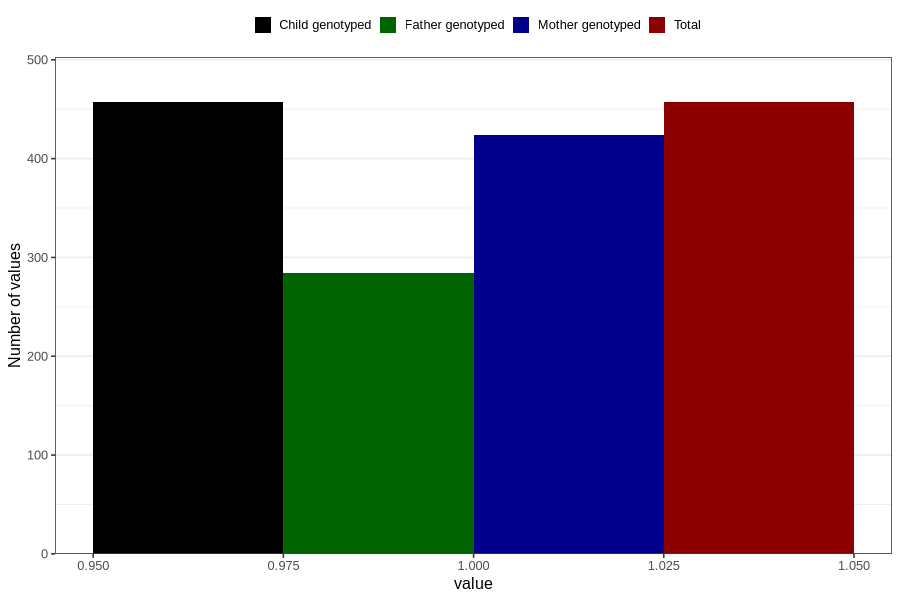

# oedema_5w_8w
Variable mapping to `AA317` in `Skjema1_v12`.
- Number of values:

| Value | Total | Child genotyped | Mother genotyped | Father genotyped |
| ----- | ----- | --------------- | ---------------- | ---------------- |
| Missing | 80349 | 80349 | 75600 | 52879 |
| Non-missing | 457 | 457 | 424 | 284 |
| 1 | 457 | 457 | 424 | 284 |

