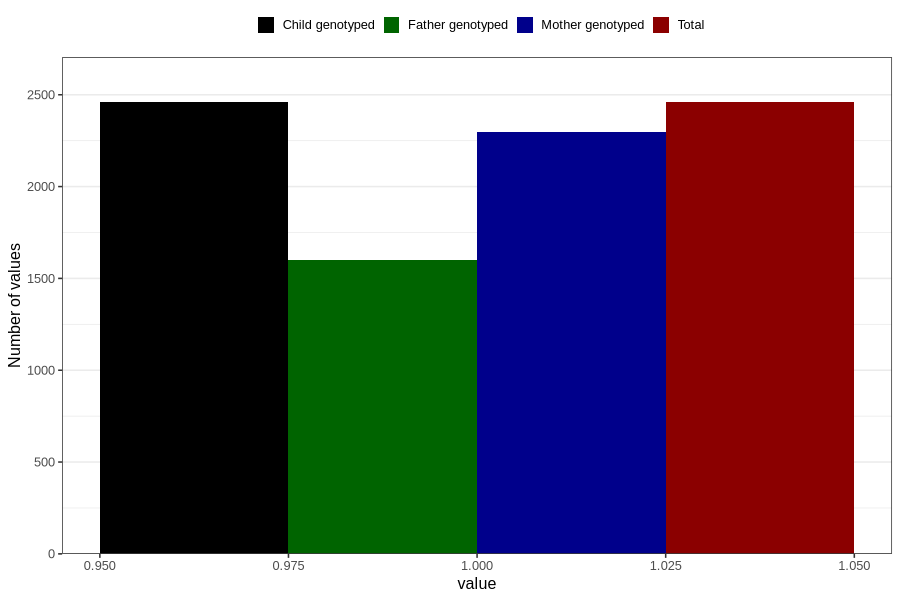

# other_muscle_joint_pain_13w_16w
Variable mapping to `CC364` in `Skjema3_v12`.
- Number of values:

| Value | Total | Child genotyped | Mother genotyped | Father genotyped |
| ----- | ----- | --------------- | ---------------- | ---------------- |
| Missing | 78347 | 78347 | 73726 | 51561 |
| Non-missing | 2459 | 2459 | 2298 | 1602 |
| 1 | 2459 | 2459 | 2298 | 1602 |

