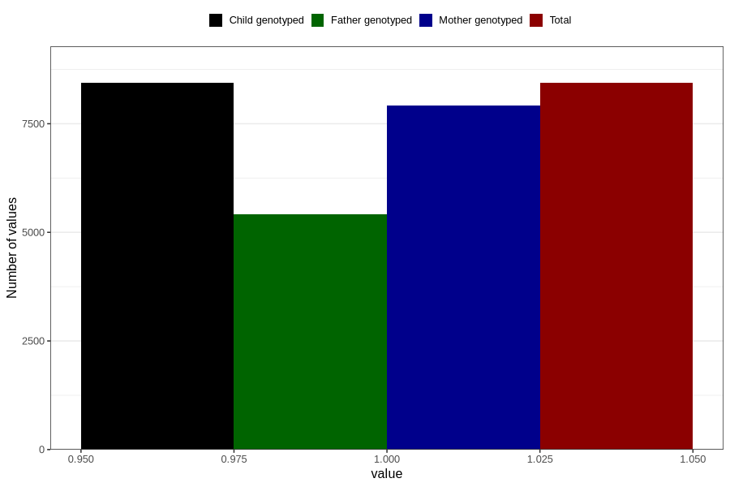

# pelvic_girdle_pain_13w_15w
Variable mapping to `AA179` in `Skjema1_v12`.
- Number of values:

| Value | Total | Child genotyped | Mother genotyped | Father genotyped |
| ----- | ----- | --------------- | ---------------- | ---------------- |
| Missing | 72369 | 72369 | 68099 | 47751 |
| Non-missing | 8437 | 8437 | 7925 | 5412 |
| 1 | 8437 | 8437 | 7925 | 5412 |

