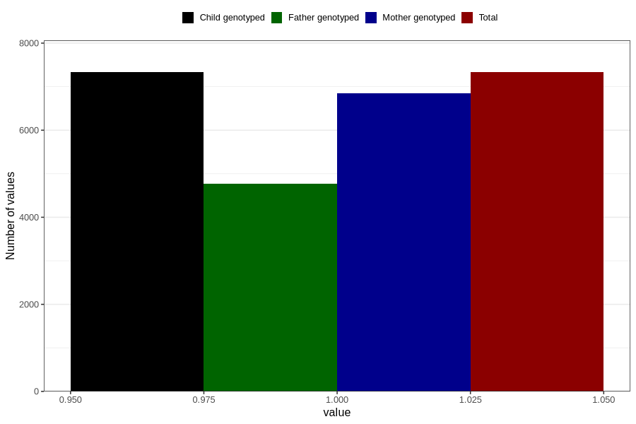

# pelvic_girdle_pain_13w_16w
Variable mapping to `CC340` in `Skjema3_v12`.
- Number of values:

| Value | Total | Child genotyped | Mother genotyped | Father genotyped |
| ----- | ----- | --------------- | ---------------- | ---------------- |
| Missing | 73476 | 73476 | 69170 | 48390 |
| Non-missing | 7330 | 7330 | 6854 | 4773 |
| 1 | 7330 | 7330 | 6854 | 4773 |

