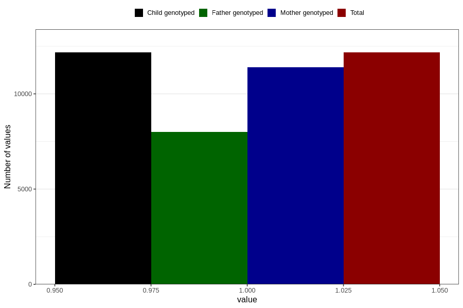

# pelvic_girdle_pain_17w_20w
Variable mapping to `CC341` in `Skjema3_v12`.
- Number of values:

| Value | Total | Child genotyped | Mother genotyped | Father genotyped |
| ----- | ----- | --------------- | ---------------- | ---------------- |
| Missing | 68635 | 68635 | 64635 | 45149 |
| Non-missing | 12171 | 12171 | 11389 | 8014 |
| 1 | 12171 | 12171 | 11389 | 8014 |

