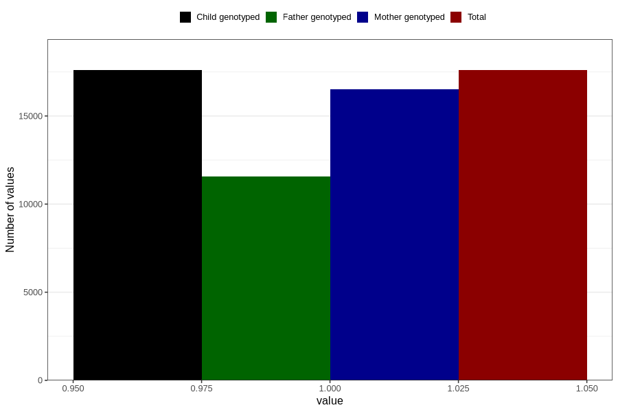

# pelvic_girdle_pain_21w_24w
Variable mapping to `CC342` in `Skjema3_v12`.
- Number of values:

| Value | Total | Child genotyped | Mother genotyped | Father genotyped |
| ----- | ----- | --------------- | ---------------- | ---------------- |
| Missing | 63210 | 63210 | 59513 | 41585 |
| Non-missing | 17596 | 17596 | 16511 | 11578 |
| 1 | 17596 | 17596 | 16511 | 11578 |

