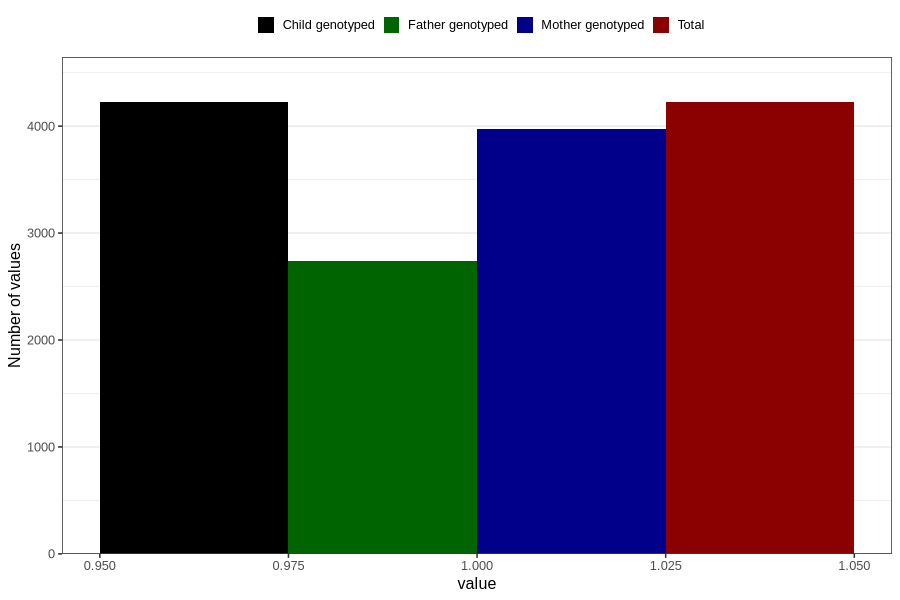

# pelvic_girdle_pain_9w_12w
Variable mapping to `AA178` in `Skjema1_v12`.
- Number of values:

| Value | Total | Child genotyped | Mother genotyped | Father genotyped |
| ----- | ----- | --------------- | ---------------- | ---------------- |
| Missing | 76583 | 76583 | 72052 | 50428 |
| Non-missing | 4223 | 4223 | 3972 | 2735 |
| 1 | 4223 | 4223 | 3972 | 2735 |

