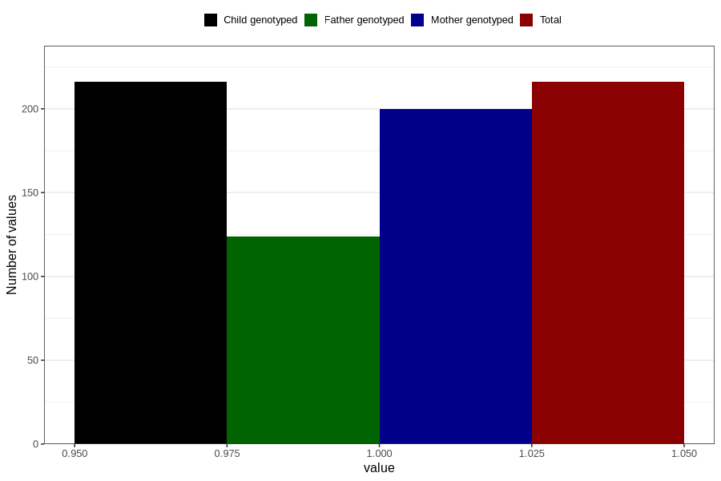

# pneumonia_bronchitis_5w_8w
Variable mapping to `AA387` in `Skjema1_v12`.
- Number of values:

| Value | Total | Child genotyped | Mother genotyped | Father genotyped |
| ----- | ----- | --------------- | ---------------- | ---------------- |
| Missing | 80590 | 80590 | 75824 | 53039 |
| Non-missing | 216 | 216 | 200 | 124 |
| 1 | 216 | 216 | 200 | 124 |

