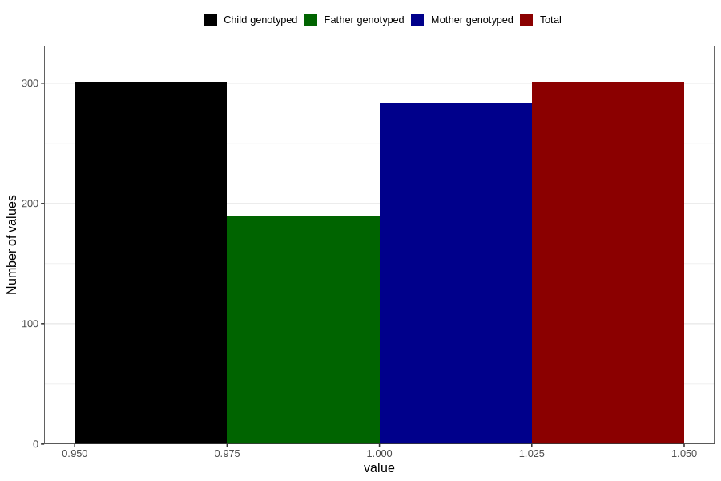

# pneumonia_bronchitis_9w_12w
Variable mapping to `AA388` in `Skjema1_v12`.
- Number of values:

| Value | Total | Child genotyped | Mother genotyped | Father genotyped |
| ----- | ----- | --------------- | ---------------- | ---------------- |
| Missing | 80505 | 80505 | 75741 | 52973 |
| Non-missing | 301 | 301 | 283 | 190 |
| 1 | 301 | 301 | 283 | 190 |

