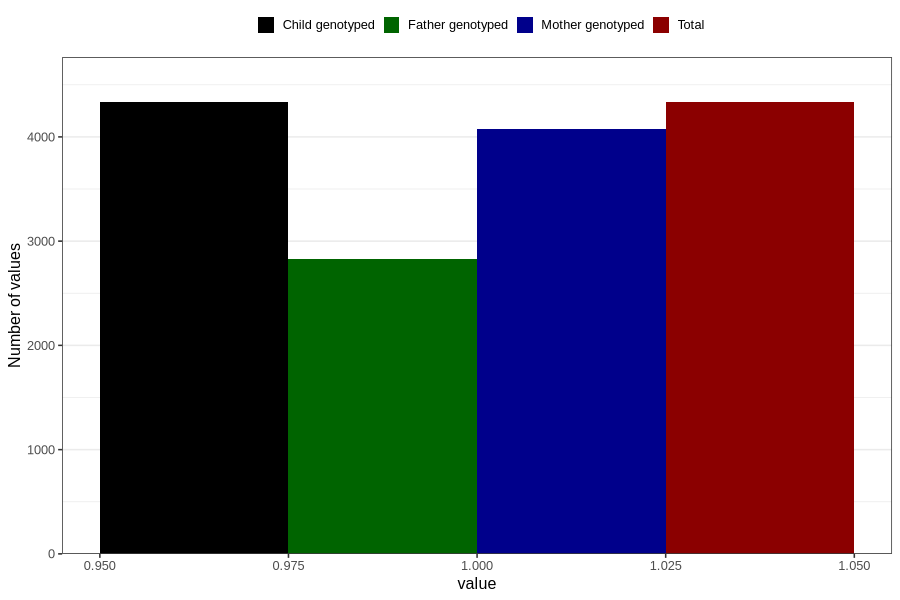

# pregnancy_itch_13w_15w
Variable mapping to `AA259` in `Skjema1_v12`.
- Number of values:

| Value | Total | Child genotyped | Mother genotyped | Father genotyped |
| ----- | ----- | --------------- | ---------------- | ---------------- |
| Missing | 76474 | 76474 | 71949 | 50332 |
| Non-missing | 4332 | 4332 | 4075 | 2831 |
| 1 | 4332 | 4332 | 4075 | 2831 |

