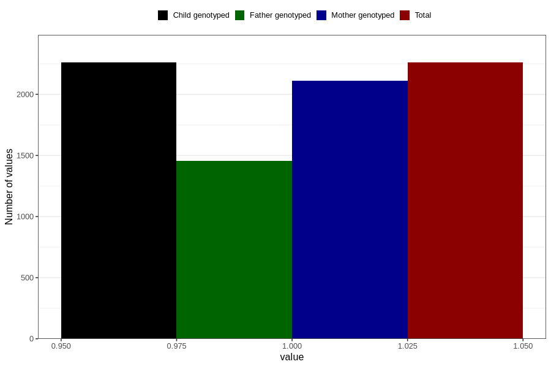

# pregnancy_itch_13w_16w
Variable mapping to `CC424` in `Skjema3_v12`.
- Number of values:

| Value | Total | Child genotyped | Mother genotyped | Father genotyped |
| ----- | ----- | --------------- | ---------------- | ---------------- |
| Missing | 78546 | 78546 | 73914 | 51709 |
| Non-missing | 2260 | 2260 | 2110 | 1454 |
| 1 | 2260 | 2260 | 2110 | 1454 |

