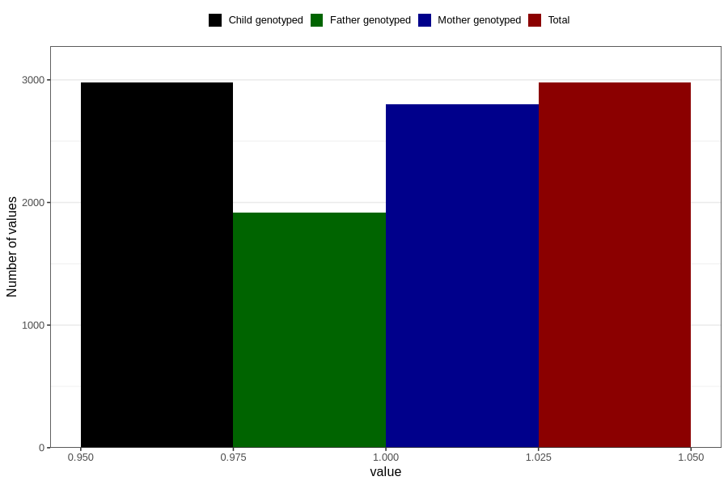

# pregnancy_itch_17w_20w
Variable mapping to `CC425` in `Skjema3_v12`.
- Number of values:

| Value | Total | Child genotyped | Mother genotyped | Father genotyped |
| ----- | ----- | --------------- | ---------------- | ---------------- |
| Missing | 77829 | 77829 | 73222 | 51243 |
| Non-missing | 2977 | 2977 | 2802 | 1920 |
| 1 | 2977 | 2977 | 2802 | 1920 |

