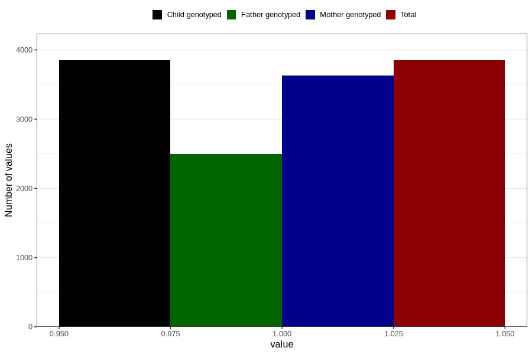

# pregnancy_itch_21w_24w
Variable mapping to `CC426` in `Skjema3_v12`.
- Number of values:

| Value | Total | Child genotyped | Mother genotyped | Father genotyped |
| ----- | ----- | --------------- | ---------------- | ---------------- |
| Missing | 76957 | 76957 | 72396 | 50671 |
| Non-missing | 3849 | 3849 | 3628 | 2492 |
| 1 | 3849 | 3849 | 3628 | 2492 |

