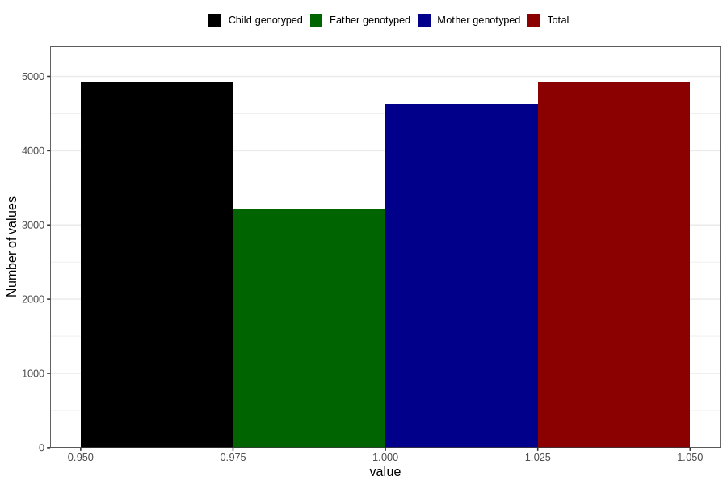

# pregnancy_itch_25w_28w
Variable mapping to `CC427` in `Skjema3_v12`.
- Number of values:

| Value | Total | Child genotyped | Mother genotyped | Father genotyped |
| ----- | ----- | --------------- | ---------------- | ---------------- |
| Missing | 75891 | 75891 | 71403 | 49956 |
| Non-missing | 4915 | 4915 | 4621 | 3207 |
| 1 | 4915 | 4915 | 4621 | 3207 |

