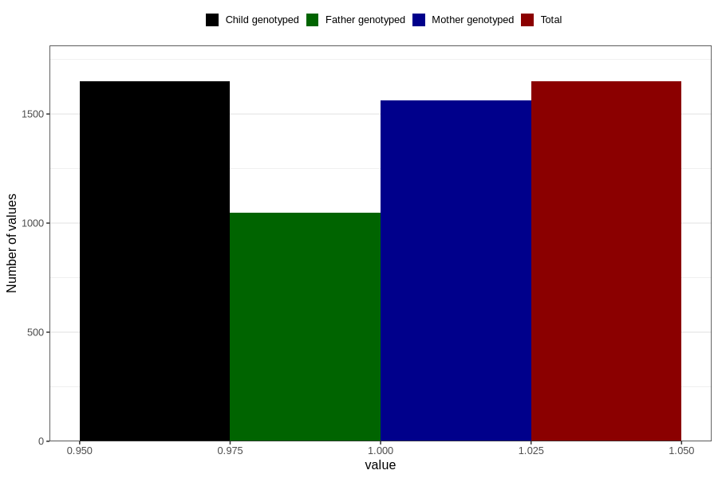

# pregnancy_itch_5w_8w
Variable mapping to `AA257` in `Skjema1_v12`.
- Number of values:

| Value | Total | Child genotyped | Mother genotyped | Father genotyped |
| ----- | ----- | --------------- | ---------------- | ---------------- |
| Missing | 79157 | 79157 | 74461 | 52114 |
| Non-missing | 1649 | 1649 | 1563 | 1049 |
| 1 | 1649 | 1649 | 1563 | 1049 |

