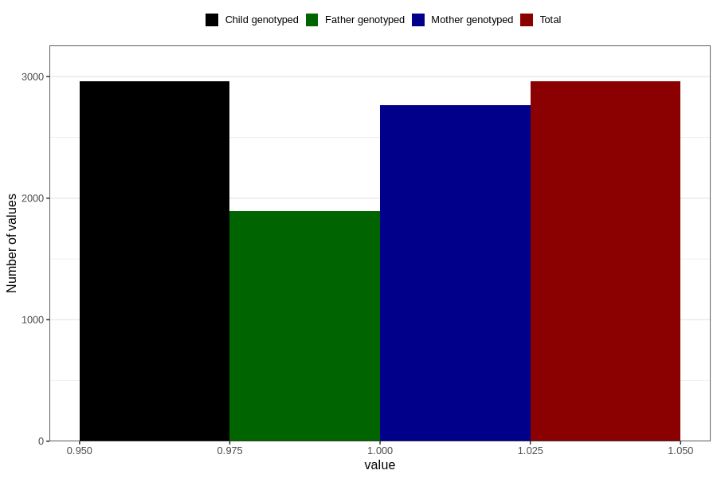

# pregnancy_itch_9w_12w
Variable mapping to `AA258` in `Skjema1_v12`.
- Number of values:

| Value | Total | Child genotyped | Mother genotyped | Father genotyped |
| ----- | ----- | --------------- | ---------------- | ---------------- |
| Missing | 77846 | 77846 | 73257 | 51272 |
| Non-missing | 2960 | 2960 | 2767 | 1891 |
| 1 | 2960 | 2960 | 2767 | 1891 |

