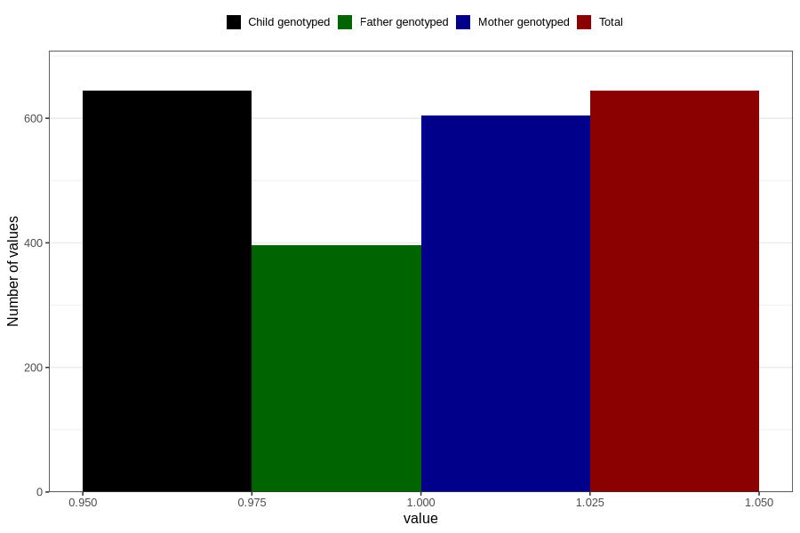

# pregnancy_itch_before_4w
Variable mapping to `AA256` in `Skjema1_v12`.
- Number of values:

| Value | Total | Child genotyped | Mother genotyped | Father genotyped |
| ----- | ----- | --------------- | ---------------- | ---------------- |
| Missing | 80162 | 80162 | 75419 | 52767 |
| Non-missing | 644 | 644 | 605 | 396 |
| 1 | 644 | 644 | 605 | 396 |

