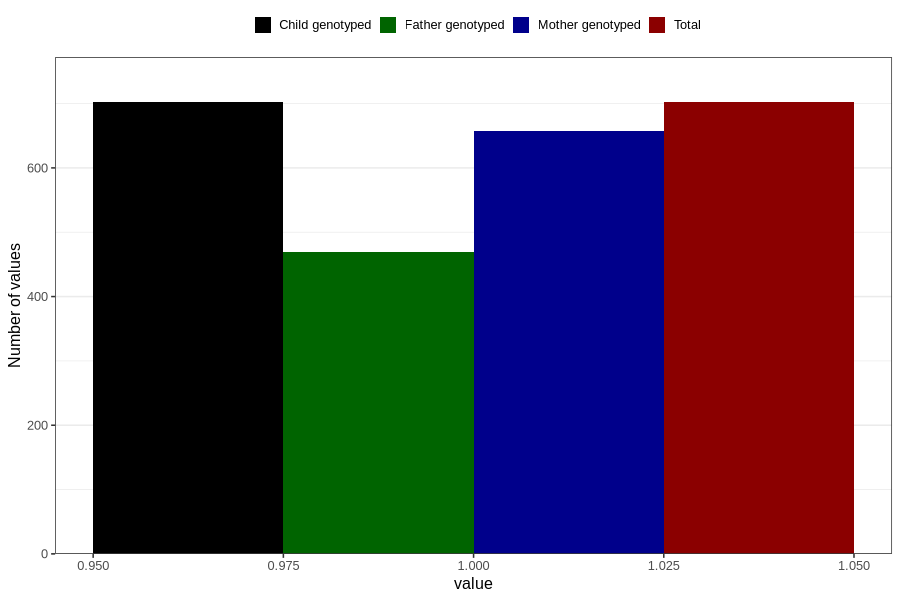

# protein_in_urine_5w_8w
Variable mapping to `AA407` in `Skjema1_v12`.
- Number of values:

| Value | Total | Child genotyped | Mother genotyped | Father genotyped |
| ----- | ----- | --------------- | ---------------- | ---------------- |
| Missing | 80104 | 80104 | 75367 | 52694 |
| Non-missing | 702 | 702 | 657 | 469 |
| 1 | 702 | 702 | 657 | 469 |

