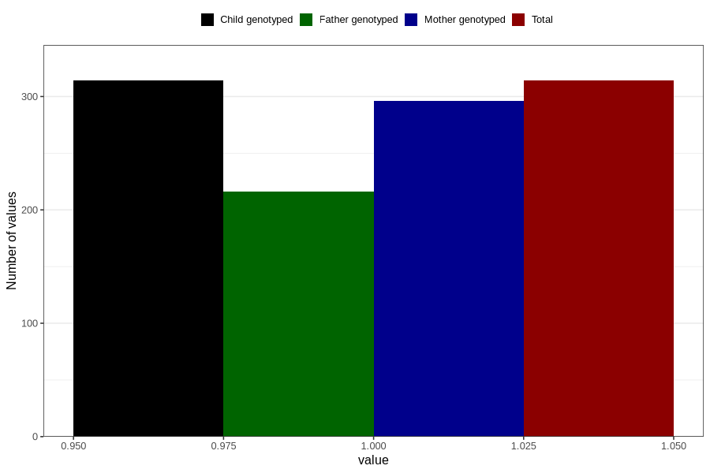

# protein_in_urine_before_4w
Variable mapping to `AA406` in `Skjema1_v12`.
- Number of values:

| Value | Total | Child genotyped | Mother genotyped | Father genotyped |
| ----- | ----- | --------------- | ---------------- | ---------------- |
| Missing | 80492 | 80492 | 75728 | 52947 |
| Non-missing | 314 | 314 | 296 | 216 |
| 1 | 314 | 314 | 296 | 216 |

