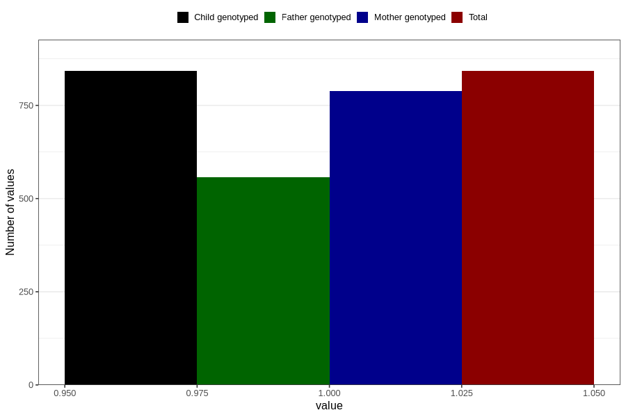

# sinusitis_ear_infection_5w_8w
Variable mapping to `AA367` in `Skjema1_v12`.
- Number of values:

| Value | Total | Child genotyped | Mother genotyped | Father genotyped |
| ----- | ----- | --------------- | ---------------- | ---------------- |
| Missing | 79964 | 79964 | 75236 | 52606 |
| Non-missing | 842 | 842 | 788 | 557 |
| 1 | 842 | 842 | 788 | 557 |

