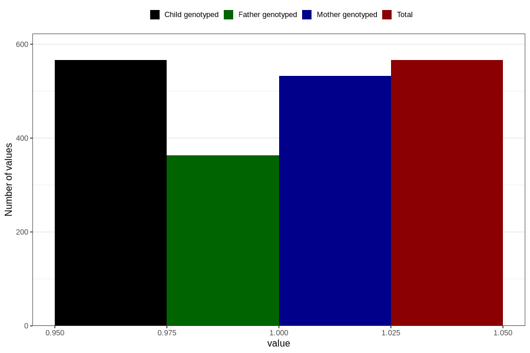

# sinusitis_ear_infection_before_4w
Variable mapping to `AA366` in `Skjema1_v12`.
- Number of values:

| Value | Total | Child genotyped | Mother genotyped | Father genotyped |
| ----- | ----- | --------------- | ---------------- | ---------------- |
| Missing | 80240 | 80240 | 75492 | 52800 |
| Non-missing | 566 | 566 | 532 | 363 |
| 1 | 566 | 566 | 532 | 363 |

