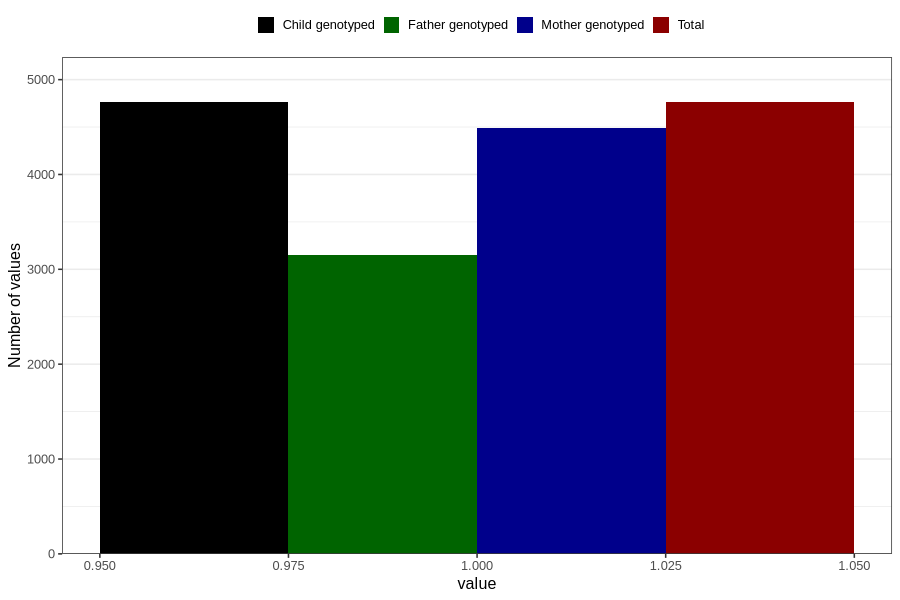

# sleeping_problems_5w_8w
Variable mapping to `AA297` in `Skjema1_v12`.
- Number of values:

| Value | Total | Child genotyped | Mother genotyped | Father genotyped |
| ----- | ----- | --------------- | ---------------- | ---------------- |
| Missing | 76045 | 76045 | 71531 | 50011 |
| Non-missing | 4761 | 4761 | 4493 | 3152 |
| 1 | 4761 | 4761 | 4493 | 3152 |

