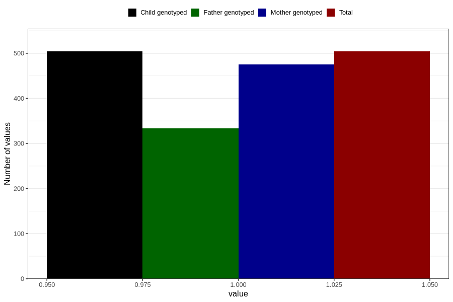

# sugar_in_urine_9w_12w
Variable mapping to `AA398` in `Skjema1_v12`.
- Number of values:

| Value | Total | Child genotyped | Mother genotyped | Father genotyped |
| ----- | ----- | --------------- | ---------------- | ---------------- |
| Missing | 80302 | 80302 | 75549 | 52829 |
| Non-missing | 504 | 504 | 475 | 334 |
| 1 | 504 | 504 | 475 | 334 |

