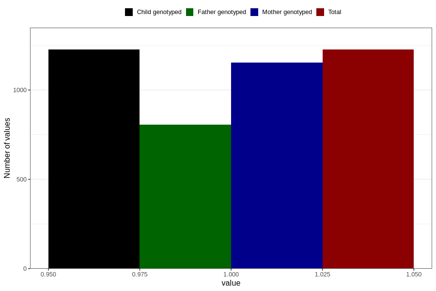

# throat_infection_13w_15w
Variable mapping to `AA359` in `Skjema1_v12`.
- Number of values:

| Value | Total | Child genotyped | Mother genotyped | Father genotyped |
| ----- | ----- | --------------- | ---------------- | ---------------- |
| Missing | 79580 | 79580 | 74870 | 52358 |
| Non-missing | 1226 | 1226 | 1154 | 805 |
| 1 | 1226 | 1226 | 1154 | 805 |

