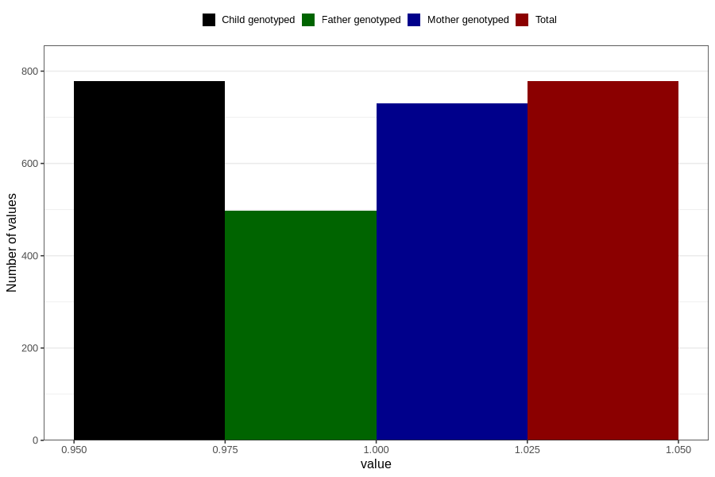

# throat_infection_9w_12w
Variable mapping to `AA358` in `Skjema1_v12`.
- Number of values:

| Value | Total | Child genotyped | Mother genotyped | Father genotyped |
| ----- | ----- | --------------- | ---------------- | ---------------- |
| Missing | 80028 | 80028 | 75294 | 52666 |
| Non-missing | 778 | 778 | 730 | 497 |
| 1 | 778 | 778 | 730 | 497 |

