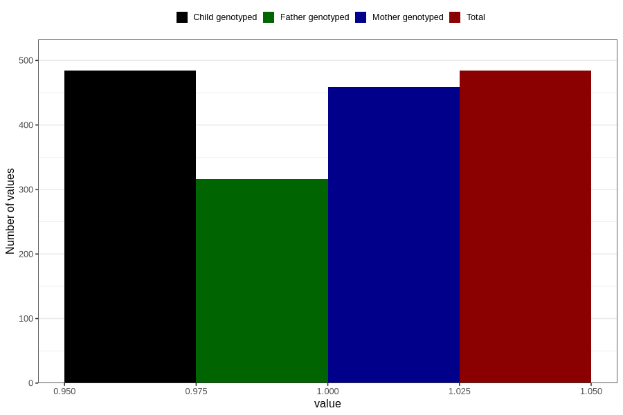

# throat_infection_before_4w
Variable mapping to `AA356` in `Skjema1_v12`.
- Number of values:

| Value | Total | Child genotyped | Mother genotyped | Father genotyped |
| ----- | ----- | --------------- | ---------------- | ---------------- |
| Missing | 80322 | 80322 | 75565 | 52847 |
| Non-missing | 484 | 484 | 459 | 316 |
| 1 | 484 | 484 | 459 | 316 |

