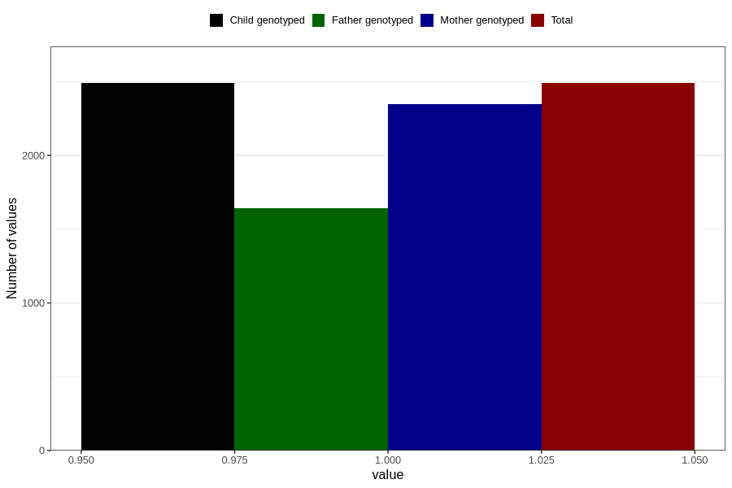

# vaginal_bleeding_1_13w_16w
Variable mapping to `CC317` in `Skjema3_v12`.
- Number of values:

| Value | Total | Child genotyped | Mother genotyped | Father genotyped |
| ----- | ----- | --------------- | ---------------- | ---------------- |
| Missing | 78316 | 78316 | 73677 | 51520 |
| Non-missing | 2490 | 2490 | 2347 | 1643 |
| 1 | 2490 | 2490 | 2347 | 1643 |

