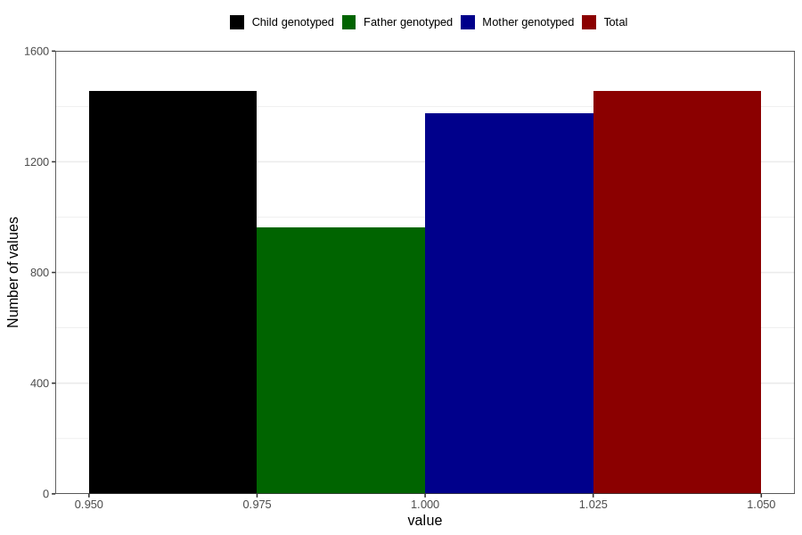

# vaginal_bleeding_1_17w_20w
Variable mapping to `CC318` in `Skjema3_v12`.
- Number of values:

| Value | Total | Child genotyped | Mother genotyped | Father genotyped |
| ----- | ----- | --------------- | ---------------- | ---------------- |
| Missing | 79351 | 79351 | 74649 | 52201 |
| Non-missing | 1455 | 1455 | 1375 | 962 |
| 1 | 1455 | 1455 | 1375 | 962 |

