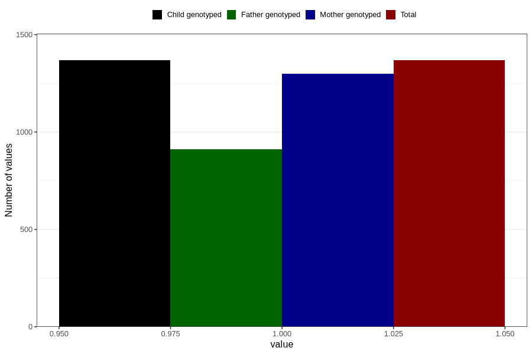

# vaginal_bleeding_1_21w_24w
Variable mapping to `CC319` in `Skjema3_v12`.
- Number of values:

| Value | Total | Child genotyped | Mother genotyped | Father genotyped |
| ----- | ----- | --------------- | ---------------- | ---------------- |
| Missing | 79438 | 79438 | 74725 | 52252 |
| Non-missing | 1368 | 1368 | 1299 | 911 |
| 1 | 1368 | 1368 | 1299 | 911 |

