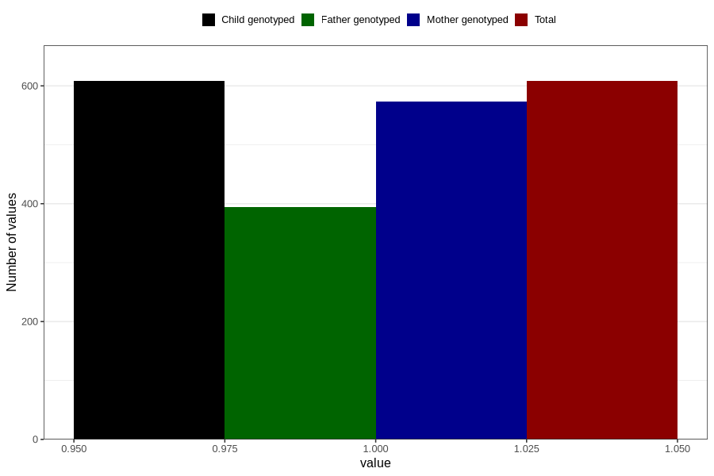

# vaginal_bleeding_1_after_29w
Variable mapping to `CC321` in `Skjema3_v12`.
- Number of values:

| Value | Total | Child genotyped | Mother genotyped | Father genotyped |
| ----- | ----- | --------------- | ---------------- | ---------------- |
| Missing | 80198 | 80198 | 75451 | 52769 |
| Non-missing | 608 | 608 | 573 | 394 |
| 1 | 608 | 608 | 573 | 394 |

