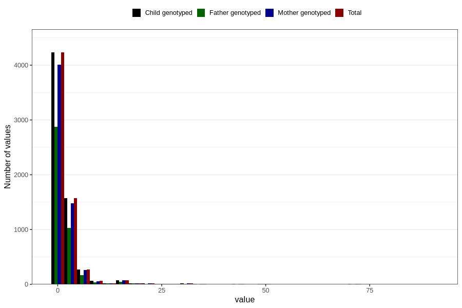

# vaginal_bleeding_1_duration
Variable mapping to `CC322` in `Skjema3_v12`.
- Number of values:

| Value | Total | Child genotyped | Mother genotyped | Father genotyped |
| ----- | ----- | --------------- | ---------------- | ---------------- |
| Missing | 74461 | 74461 | 70029 | 48918 |
| Non-missing | 6345 | 6345 | 5995 | 4245 |
| 25th percentile | 1 | 1 | 1 | 1 |
| 50th percentile | 1 | 1 | 1 | 1 |
| 75th percentile | 2 | 2 | 2 | 2 |
| Mean | 2.40299448384555 | 2.40299448384555 | 2.40083402835696 | 2.26713780918728 |
| Standard deviation | 5.20010280819178 | 5.20010280819178 | 5.21339417114802 | 4.7420518780616 |
| N | 6345 | 6345 | 5995 | 4245 |

