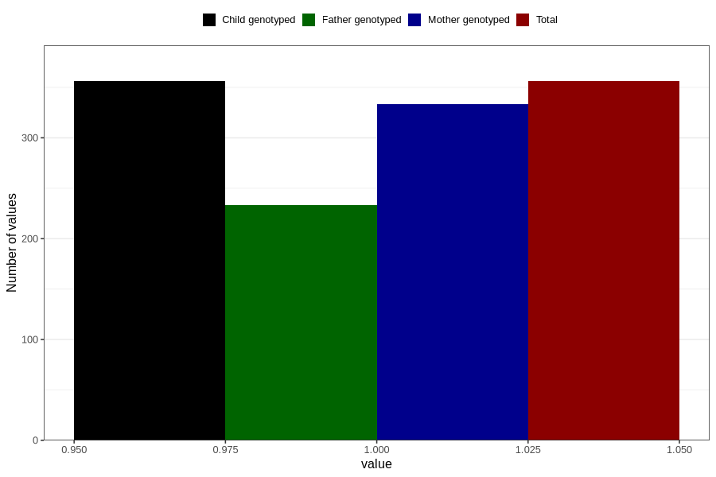

# vaginal_bleeding_2_13w_16w
Variable mapping to `CC324` in `Skjema3_v12`.
- Number of values:

| Value | Total | Child genotyped | Mother genotyped | Father genotyped |
| ----- | ----- | --------------- | ---------------- | ---------------- |
| Missing | 80450 | 80450 | 75691 | 52930 |
| Non-missing | 356 | 356 | 333 | 233 |
| 1 | 356 | 356 | 333 | 233 |

